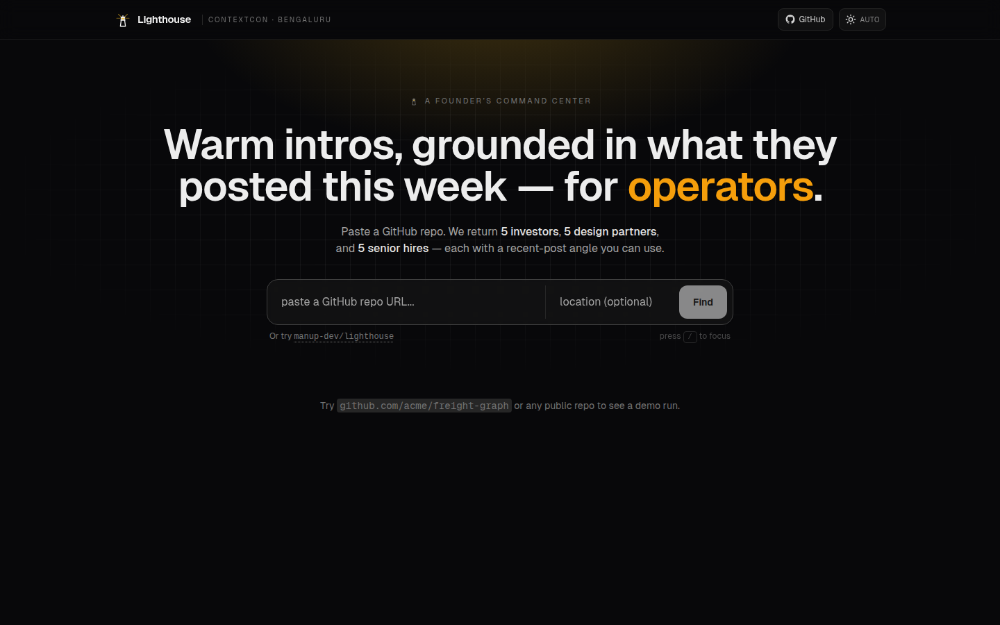
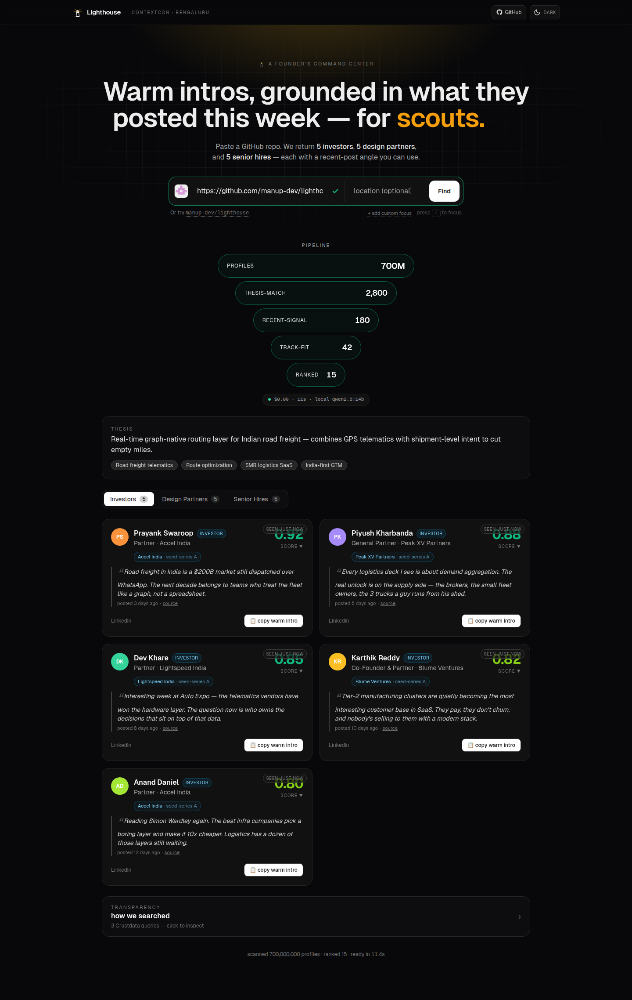

# Lighthouse

**From `git push` to go-to-market.**

Lighthouse is a founder's command center. Paste a GitHub repo URL. Roughly a minute later, three ranked lists of five humans each:

- **5 investors** who posted publicly about your technical moat in the last 14 days
- **5 design partners** — companies whose execs publicly signalled the pain you solve
- **5 senior hires** within commuting distance, scored on trajectory and recent public activity

Every one of the fifteen comes with a warm-intro draft **grounded in something that person actually published in the last two weeks.** No cold templates.



<!-- LIVE_URL:START -->
**Try it live:** https://prices-bargains-purse-bedrooms.trycloudflare.com _(last updated 2026-04-19)_
<!-- LIVE_URL:END -->

---

## Hosting — this is running on my laptop

There is no cloud. Lighthouse is currently served **from a single desktop** with a 5070 Ti, fronted by a free cloudflared quick-tunnel:

```
your browser
    │  https://<random>.trycloudflare.com
    ▼
cloudflared  ─────────────────┐
                              │
        127.0.0.1:3737  Next.js 14 UI (proxies /api/*)
                              │
        127.0.0.1:8787  FastAPI + SSE  (Pipeline)
                              │
        127.0.0.1:11434 Ollama · qwen2.5:14b-instruct-q4_K_M on GPU
```

Only the Next.js port is exposed. **FastAPI and Ollama stay on loopback** — the LLM and the Crustdata key never leave the laptop. Bring up the whole stack with:

```bash
./scripts/redeploy.sh --tunnel     # api + web + public URL
./scripts/post-reboot.sh           # same, plus GPU warm + gallery bake
```

Prefer containers? The whole stack is dockerised:

```bash
cp .env.example .env               # fill in ANTHROPIC_API_KEY + CRUSTDATA_API_KEY
docker compose up --build          # api :8787 · web :3737
docker compose --profile local-llm up --build   # …also boots Ollama on :11434
```

Anthropic is available as an opt-in primary with a spend cap (`LIGHTHOUSE_LLM=budgeted`, `LIGHTHOUSE_ANTHROPIC_BUDGET_USD=5`) — it auto-falls-back to local Qwen once the cap trips or the call fails, so the demo cannot silently drain a key.

---

## Why this shape

A founder's first six months is three parallel research streams — fundraising, sales, hiring — and all three collapse to the same move: *find humans who already publicly signalled that they care, then send a specific, grounded message.* Lighthouse is the agent that does all three from one input.

## How it works

```
GitHub repo URL
    │
    ▼
RepoAnalyzer      ← README, pyproject / package.json, last 50 commits
    │
    ▼
ThesisEngine      ← LLM call #1: moat · themes · ICP · ideal-hire profile
    │
    ▼
QueryPlanner      ← LLM call #2: 6–9 Crustdata-native payloads
    │                (title-normalized, geo-distanced, operator-healed)
    ▼
CrustClient       ← async fan-out to Person · Company · Web APIs (cached)
    │
    ▼
Enricher          ← optional profile hydration for thin hits
    │
    ▼
3× Ranker         ← LLM calls #3: one per track, weighted rubric
    │
    ▼
OutreachDrafter   ← LLM call #4 (batched): 15 warm intros
    │                grounded in each person's recent public post
    ▼
Tri-fold funnel: Investors · Design Partners · Talent
    │
    ▼
MissionCard ─▶ DraftForge ─▶ Claude-Code handoff
  (track)       (local-qwen       (copies full
                 variant refiner)   context to CC)
```

**4 primary LLM calls. 6 Crustdata endpoints. 15 outputs. ≈60s on local 14B, ≈20s on Anthropic, ≈0 credits per local run.**



## What you can actually do on the page

- **Pipeline funnel** counts down `700M profiles → 15 ranked` in real time, driven by SSE events from FastAPI.
- **Live backend trace** (expand the `BACKEND TRACE` console) shows every Crustdata call, LLM stage, and cost as it happens.
- **3 track tabs** — Investors / Design Partners / Senior Hires — with per-person scores and the exact recent post the outreach is grounded in.
- **Copy warm intro** drops a ready-to-paste message on your clipboard. `localStorage` remembers who you copied so re-contact dedup badges light up.
- **DraftForge** opens a local-model refiner next to the card. Type `make it shorter`, `lead with their Jan 14 post`, `match their casual tone` — three variants stream back from Qwen on-device in ~4s.
- **Claude-Code handoff** copies a full briefing (person, thesis, recent post, user's intent) into your clipboard so you can paste it straight into Claude Code and continue the thread.
- **"How we searched"** transparency panel lists every Crustdata query with its purpose — click any row to inspect the exact JSON payload.

| | |
|---|---|
|  |  |
| Ranked investors with score + recent-post excerpts | Design partners with signal dates and source links |


*Every Crustdata call is listed and inspectable — no hidden queries.*


*Per-call streaming trace — LLM stages, fan-out timings, Crustdata errors, token cost.*

## Design decisions we committed to

- **Every LLM call is visible** in the UI — no black-box reasoning
- **Title normalization at query-plan time**, not match time — one call covers *"Head of Engineering / VP Eng / Director of Engineering"*
- **Operator healing** in the query planner — fixes `<=` / `>=` / `=~` mistakes from the model so Crustdata stops 400-ing
- **`geo_distance` is first-class** on the Talent track — each card shows its explicit radius
- **Contact history is client-side only** — localStorage remembers who you copied / marked sent. Dedup badges warn before re-contacting. Zero server-side PII.
- **Four single-turn LLM calls**, not an agent loop — deterministic, inspectable, cacheable
- **Single-GPU queue** with live position + ETA — one pipeline runs at a time, everyone else gets a "you're #N, ~Xs" banner instead of a dropped request
- **Gallery fallback** — when the queue is full or the backend trips, the UI shows baked demo runs instead of a stack trace
- **Budget guardrail on Anthropic** — `BudgetedLLM` records real token usage to disk and silently falls back to local Qwen once the cap trips

## Powered by

- **Crustdata** — `/person/search`, `/person/enrich`, `/company/search`, `/company/enrich`, `/company/identify`, `/web/search/live`
- **Ollama + Qwen 2.5 14B** (local, default) — thesis · query plan · ranking · outreach · draft refinement
- **Anthropic Claude Sonnet 4.6** (opt-in, budgeted fallback) — same four stages, faster
- **Model Context Protocol (MCP)** — same engine callable from inside Claude Code, both founder-mode (`lighthouse_investors_for_repo`) and recruiter-mode (`lighthouse_candidates_for_jd`)
- **Next.js 14 · FastAPI · SSE** — the surface you see above

## Surfaces

```bash
# CLI — one-shot
uv run lighthouse https://github.com/manup-dev/lighthouse

# Web UI (what the cloudflared tunnel points at)
./scripts/redeploy.sh                # api :8787 + web :3737 on localhost
./scripts/redeploy.sh --tunnel       # …plus a public trycloudflare URL

# MCP (from inside Claude Code)
/mcp → lighthouse → "find investors for https://github.com/manup-dev/lighthouse"
/mcp → lighthouse → "candidates for https://jobs.example.com/senior-backend"
```

## One engine, many personas

Lighthouse is structured as `ArtifactAdapter → Thesis → TrackMix → Rubric`. Swap those slots, get a different product on the same engine:

| Persona        | Input artifact              | Output tracks                                     |
|---             |---                          |---                                                |
| Founder        | GitHub repo                 | Investors · Design Partners · Talent              |
| Recruiter      | Job description URL         | Active · Passive · Prior-employer intel           |
| Investor / VC  | Thesis paragraph            | Deal candidates · Founders to meet · Co-investors |
| BD / Sales     | Product page or one-pager   | Target accounts · Champions · Intent-signal buyers|

Founder mode is today's demo. Recruiter mode already ships as an MCP tool. The other two are one adapter away.

## Status

Built at **ContextCon** — Crustdata × Y Combinator, Bengaluru, 19 April 2026. Lighthouse touches three of YC's Spring 2026 RFS themes from a single input — AI-Native Agencies, AI-Native Hedge Funds (investor mode), AI Guidance for Physical Work (geo-located hiring).

## The team

Solo founder for now — Manu.
Install the companion chrome extension [themarkdownreader](https://github.com/manup-dev/themarkdownreader) to read this better.

## License

MIT
